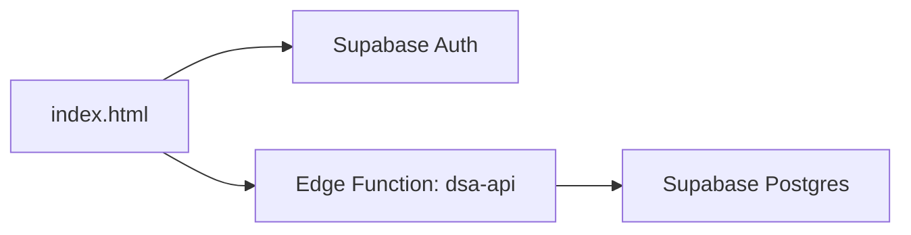

# DSA Duty Roster Supabase Backend

This project is a TypeScript frontend for the DSA duty roster, backed by Supabase Auth, a Supabase Edge Function, and Supabase Postgres.

## Architecture



The browser signs in with Supabase Auth and sends the user's JWT to `dsa-api`. The Edge Function validates the user, uses the service role key on the server side, and stores roster data in Postgres. Public self-registration is disabled; users are created by an administrator in Supabase Auth.

## Files

- `index.html`: Vite HTML entry file.
- `src/main.ts`: frontend bootstrap.
- `src/render.ts`: dashboard, roster, live, settings, history, and auth UI behavior.
- `src/state.ts`: typed roster defaults and session state helpers.
- `src/api.ts`: Supabase Auth and Edge Function calls.
- `src/styles.css`: app styling.
- `supabase/migrations/20260714143500_create_dsa_backend.sql`: database schema, indexes, and RLS.
- `supabase/migrations/20260715143500_add_integrity_constraints.sql`: follow-up production constraints.
- `supabase/functions/dsa-api/index.ts`: backend API router.
- `supabase/functions/dsa-api/*.ts`: modular auth, validation, sessions, cases, procedure rooms, history, audit, and utility code.
- `.env.example`: required environment values.

## Configure Frontend

The frontend credentials are configured in `src/config.ts`:

```js
export const SUPABASE_URL = "https://kpjynehmvmapyywjhyqj.supabase.co";
export const SUPABASE_ANON_KEY = "...";
```

Use your Supabase project URL and anon key from Project Settings > API.

## Configure Edge Function Secrets

For local development:

```powershell
supabase secrets set SUPABASE_URL="https://your-project-ref.supabase.co"
supabase secrets set SUPABASE_SERVICE_ROLE_KEY="your-service-role-key"
supabase secrets set DSA_ALLOWED_ORIGIN="http://localhost:5173"
```

For production, set `DSA_ALLOWED_ORIGIN` to the deployed frontend URL. Keep `SUPABASE_SERVICE_ROLE_KEY` server-side only.

## Local Development

Install frontend dependencies:

```powershell
npm install
```

Run the TypeScript frontend:

```powershell
npm run dev
```

Build the frontend:

```powershell
npm run build
```

Run Supabase locally only if you want a local backend:

```powershell
supabase start
supabase db reset
supabase functions serve dsa-api
```

## Deploy

```powershell
npx supabase link --project-ref kpjynehmvmapyywjhyqj
npx supabase db push --linked --yes
npx supabase functions deploy dsa-api --project-ref kpjynehmvmapyywjhyqj
```

If the first migration was already run manually in the SQL Editor, repair migration history before pushing new migrations:

```powershell
npx supabase migration repair --linked --status applied 20260714143500 --yes
```

## Users

Create real users in Supabase Authentication > Users. All active authenticated users can use the app. The old demo emails can be reused:

- `admin@dsa.pk`
- `drsalman@dsa.pk`
- `rohail@dsa.pk`
- `saba@dsa.pk`
- `hammad@dsa.pk`
- `namra@dsa.pk`

When a user signs in for the first time, the Edge Function automatically creates an active `profiles` row from their auth account metadata.
